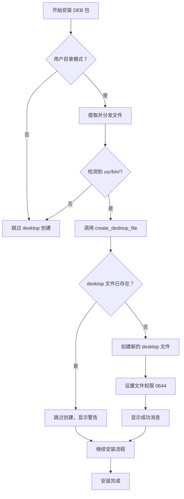

# Desktop 文件自动创建功能 - 变更日志

## 版本信息
- **功能名称**: Desktop 文件自动创建
- **实现日期**: 2024
- **影响范围**: 用户目录安装模式 (`-u`)
- **兼容性**: 完全向后兼容

## 📦 新增文件

### 源代码文件

1. **`include/desktop.h`** (1.0 KB)
   - Desktop 文件创建模块的公共接口
   - 声明 `create_desktop_file()` 函数

2. **`src/desktop.c`** (2.7 KB)
   - Desktop 文件创建功能的实现
   - 生成符合 XDG 规范的 .desktop 文件
   - 包含文件存在检测和错误处理

### 文档文件

3. **`DESKTOP_FILE_FEATURE.md`**
   - 功能详细说明文档
   - 使用方法和注意事项

4. **`DESKTOP_FEATURE_SUMMARY.md`**
   - 实现总结文档
   - 技术细节和未来改进建议

5. **`DESKTOP_USAGE_EXAMPLES.md`**
   - 详细的使用示例
   - 自定义和故障排查指南

6. **`test_desktop.sh`**
   - 功能测试脚本
   - 验证编译和集成状态

## 🔧 修改文件

### 核心代码

1. **`src/install_user.c`**
   ```diff
   + #include "../include/desktop.h"
   
     // 在安装成功后
   + if (is_directory(dst_bin)) {
   +     print_info("Creating desktop file...");
   +     if (create_desktop_file(pkg_name, home_dir) == 0) {
   +         print_success("Desktop entry created successfully!");
   +     } else {
   +         print_warning("Failed to create desktop file");
   +     }
   + }
   
     print_info("Installation summary:");
   + printf("  Desktop file:  ~/.local/share/applications/%s.desktop\n", pkg_name);
   ```

### 项目文档

2. **`README.md`**
   - 更新用户目录安装的目录结构图
   - 添加 `applications/` 目录说明
   - 在安装位置表格中添加 desktop 文件行
   - 在安装特点中强调桌面集成功能

3. **`MODULES.md`**
   - 更新项目结构图（添加 desktop.h 和 desktop.c）
   - 新增第 7 节：desktop 模块说明
   - 包含功能描述、API、使用示例

## 🎯 功能特性

### 核心功能
- ✅ 自动创建 XDG 标准的 desktop 文件
- ✅ 智能检测已存在文件，避免覆盖
- ✅ 仅在检测到可执行文件时创建
- ✅ 仅支持用户目录安装模式

### 技术特点
- ✅ 模块化设计，职责单一
- ✅ 符合 C99 标准
- ✅ 完善的错误处理
- ✅ 清晰的彩色输出

### 用户体验
- ✅ 应用程序自动出现在菜单
- ✅ 无需手动配置启动器
- ✅ 支持后续自定义编辑
- ✅ 友好的安装提示

## 📋 Desktop 文件规格

### 文件位置
```
~/.local/share/applications/<package-name>.desktop
```

### 文件内容
```ini
[Desktop Entry]
Version=1.0
Type=Application
Name=<package-name>
Comment=Application installed by debpkg
Exec=/home/<username>/.local/bin/<package-name>
Icon=application-x-executable
Path=
Terminal=false
Categories=Application;
StartupNotify=true
```

### 权限设置
- 文件权限：`0644` (-rw-r--r--)
- 所有者：当前用户
- 组：当前用户组

## 🔄 工作流程



## 🧪 测试验证

### 编译测试
```bash
make clean && make
# 结果：✅ 编译成功，无错误无警告
```

### 代码检查
```bash
get_problems
# 结果：✅ 无语法错误
```

### 功能测试
```bash
./test_desktop.sh
# 结果：✅ 所有检查通过
```

## 📊 代码统计

| 类型 | 数量 | 说明 |
|------|------|------|
| 新增头文件 | 1 | desktop.h |
| 新增源文件 | 1 | desktop.c |
| 修改源文件 | 1 | install_user.c |
| 新增文档 | 4 | 功能说明、总结、示例、变更记录 |
| 测试脚本 | 1 | test_desktop.sh |
| 总新增代码 | ~100 行 | 不含注释和空行 |

## 🎓 遵循规范

### XDG 规范
- ✅ XDG Base Directory Specification
- ✅ XDG Desktop Entry Specification
- ✅ XDG Icon Theme Specification (兼容)

### 项目规范
- ✅ 模块化架构设计
- ✅ C99 标准编译
- ✅ GPL v2 许可证
- ✅ 标准目录结构

### 代码质量
- ✅ 单一职责原则
- ✅ 清晰的接口定义
- ✅ 完善的错误处理
- ✅ 一致的命名风格

## 🚀 使用场景

### 适用情况
- 图形界面应用程序
- 需要快速启动的工具
- 希望集成到菜单的应用
- 多用户使用的应用程序

### 不适用情况
- 纯库文件包（无 executables）
- 系统服务或守护进程
- 命令行工具（除非自定义 Terminal=true）
- 系统级安装（`-s` 模式）

## 🔮 未来改进

### 短期计划
- [ ] 从 DEB 包中提取并设置图标
- [ ] 自动识别应用类别
- [ ] 支持多语言 Name 和 Comment

### 中期计划
- [ ] 卸载时自动删除 desktop 文件
- [ ] 支持自定义 desktop 模板
- [ ] 自动检测终端应用

### 长期愿景
- [ ] 完整的桌面集成方案
- [ ] 支持 Actions 扩展字段
- [ ] 快捷键配置支持

## 📝 相关文档索引

### 主要文档
- [README.md](README.md) - 项目主文档
- [MODULES.md](MODULES.md) - 模块架构说明
- [DESKTOP_FILE_FEATURE.md](DESKTOP_FILE_FEATURE.md) - 功能详细说明

### 使用指南
- [DESKTOP_USAGE_EXAMPLES.md](DESKTOP_USAGE_EXAMPLES.md) - 使用示例
- [QUICKSTART.md](QUICKSTART.md) - 快速上手

### 参考资料
- [XDG_DIRECTORIES.md](XDG_DIRECTORIES.md) - XDG 目录规范
- [USER_DIRECTORY_INSTALL.md](USER_DIRECTORY_INSTALL.md) - 用户目录安装指南

## ⚠️ 注意事项

### 重要提示
1. **仅支持用户目录安装** - 系统级安装不会创建 desktop 文件
2. **需要可执行文件** - 没有 bin/ 目录不会创建
3. **不覆盖已有文件** - 保护用户自定义配置
4. **可能需要刷新** - 某些桌面环境需要重启或刷新数据库

### 已知限制
- 不支持自定义 desktop 模板（需手动编辑）
- 不自动提取图标（需手动设置）
- 不自动删除（卸载时需手动清理）

## 🎉 总结

Desktop 文件自动创建功能为 debpkg 的用户目录安装模式提供了完整的桌面集成体验。该功能：

✨ **对用户友好** - 应用安装后立即可用，无需手动配置  
🔧 **易于维护** - 模块化实现，职责清晰  
📐 **符合标准** - 严格遵循 XDG 规范  
🚀 **高质量** - 完善的错误处理和代码质量  

这标志着 debpkg 在提升用户体验方面又向前迈进了一步！

---

*最后更新：2024*
