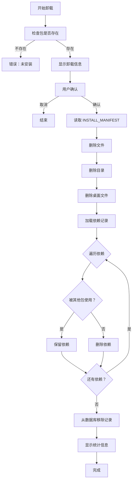

# 智能卸载功能

## 🎯 功能概述

实现用户目录下 DEB 包的智能卸载功能，具备依赖关系检查和保护机制。在卸载包时会自动分析依赖关系，只有当依赖不被其他包使用时才会删除，确保系统的稳定性和依赖完整性。

## ✨ 核心特性

### 1. **智能依赖检查** 🔍
- ✅ 自动检测依赖是否被其他包使用
- ✅ 被使用的依赖会被保留
- ✅ 未被使用的依赖会被清理
- ✅ 详细的依赖使用报告

### 2. **安全卸载** 🛡️
- ✅ 卸载前显示详细信息
- ✅ 用户确认后才执行
- ✅ 基于 INSTALL_MANIFEST 精确删除
- ✅ 不删除仍被使用的依赖

### 3. **完整的清理** 🧹
- ✅ 删除可执行文件（`~/.local/bin/`）
- ✅ 删除库文件（`~/.local/lib/`）
- ✅ 删除数据文件（`~/.local/share/<pkg>/`）
- ✅ 删除配置文件（`~/.local/etc/<pkg>/`）
- ✅ 删除桌面文件（`*.desktop`）
- ✅ 从依赖数据库移除记录

### 4. **详细反馈** 📊
- ✅ 显示删除的文件数量
- ✅ 显示删除的目录数量
- ✅ 显示保留的依赖数量
- ✅ 显示删除的依赖数量

## 📦 新增模块

### `uninstall.h` / `uninstall.c` (12 KB)

**数据结构**:

```c
// 卸载选项
typedef struct {
    int force;              // 强制卸载（忽略依赖检查）
    int dry_run;           // 仅模拟，不实际删除
    int verbose;           // 详细输出
} UninstallOptions;

// 卸载结果统计
typedef struct {
    int files_removed;      // 删除的文件数
    int dirs_removed;       // 删除的目录数
    int deps_kept;          // 保留的依赖数
    int deps_removed;       // 删除的依赖数
} UninstallResult;
```

**核心函数**:

1. **`uninstall_package_smart()`** - 主卸载函数
   - 智能检查依赖关系
   - 保护正在使用的依赖
   - 完整的清理流程

2. **`check_dependency_usage()`** - 依赖使用检查
   - 扫描所有已安装包
   - 查找依赖引用
   - 返回使用者数量

3. **`get_package_manifest()`** - 获取安装清单
   - 读取 INSTALL_MANIFEST
   - 解析文件列表
   - 构建完整路径

4. **`remove_package_files()`** - 执行文件删除
   - 逐个删除文件
   - 删除空目录
   - 统计删除数量

5. **`cleanup_unused_dependencies()`** - 清理未用依赖
   - 加载依赖记录
   - 检查每个依赖
   - 删除未使用者

6. **`show_uninstall_info()`** - 显示卸载信息
   - 包名称
   - 影响范围
   - 注意事项

## 🔧 使用方法

### 基本语法

```bash
./debpkg -r <package-name>
# 或
./debpkg --remove <package-name>
# 或
./debpkg --uninstall <package-name>
```

### 使用示例

#### 示例 1: 卸载包

```bash
$ ./debpkg -r myapp

[INFO] Uninstalling package: myapp

═══════════════════════════════════════════════════════════
Uninstall Information:
Package: myapp

Will remove:
  - Executables from: ~/.local/bin/
  - Libraries from: ~/.local/lib/
  - Data from: ~/.local/share/myapp/
  - Config from: ~/.local/etc/myapp/

[NOTE] Dependencies will be checked before removal.
[NOTE] Only unused dependencies will be removed.
═══════════════════════════════════════════════════════════

Do you want to proceed with uninstall? (y/n): y

[INFO] Starting uninstall process...
[INFO] Removing files...
  Removed: /home/user/.local/bin/myapp
  Removed: /home/user/.local/lib/libmyapp.so
  ...
  Removed dir: /home/user/.local/share/myapp
  Removed desktop file: /home/user/.local/share/applications/myapp.desktop

[INFO] Checking dependencies...
  Keeping libfoo                         (used by 1 other package(s))
  Removing unused dependency: libbar
  Keeping libbaz                         (used by 2 other package(s))

[SUCCESS] Uninstall completed!
Files removed: 15
Directories removed: 3
Dependencies kept: 2
Dependencies removed: 1
```

#### 示例 2: 卸载不存在的包

```bash
$ ./debpkg -r nonexistent

[ERROR] Package is not installed
[ERROR] Failed to uninstall package
```

#### 示例 3: 取消卸载

```bash
$ ./debpkg -r myapp

[INFO] Uninstalling package: myapp
...
Do you want to proceed with uninstall? (y/n): n

[INFO] Uninstall cancelled
```

## 📊 工作流程

### 卸载流程图



### 依赖检查逻辑

```c
int check_dependency_usage(dep_name, exclude_pkg, home_dir) {
    打开依赖数据库 user_deps.db
    
    usage_count = 0
    遍历每个包的记录 {
        跳过 exclude_pkg（当前卸载的包）
        
        解析依赖列表
        
        遍历依赖 {
            提取依赖名
            
            if (依赖名 == dep_name) {
                usage_count++
                break
            }
        }
    }
    
    关闭数据库
    return usage_count
}
```

## 🎨 依赖保护机制

### 场景 1: 依赖被其他包使用

```
已安装包:
  - myapp → 依赖：libfoo, libbar
  - anotherapp → 依赖：libfoo, libbaz

卸载 myapp:
  ✓ libfoo - 被 anotherapp 使用 → 保留
  ✓ libbar - 未被使用 → 删除
```

### 场景 2: 依赖未被使用

```
已安装包:
  - myapp → 依赖：libfoo, libbar

卸载 myapp:
  ✓ libfoo - 未被使用 → 删除
  ✓ libbar - 未被使用 → 删除
```

### 场景 3: 多个包共享依赖

```
已安装包:
  - app1 → 依赖：libshared
  - app2 → 依赖：libshared
  - app3 → 依赖：libshared

卸载 app1:
  ✓ libshared - 被 app2, app3 使用（2 个）→ 保留

卸载 app2:
  ✓ libshared - 被 app3 使用（1 个）→ 保留

卸载 app3:
  ✓ libshared - 未被使用 → 删除
```

## 📋 文件删除规则

### 会删除的文件

1. **INSTALL_MANIFEST 中列出的所有文件**
   ```
   Binary: ~/.local/bin/myapp
   Library: ~/.local/lib/libmyapp.so
   Header: ~/.local/include/myapp/myapp.h
   Data: ~/.local/share/myapp/data.dat
   Man: ~/.local/share/man/man1/myapp.1
   ```

2. **包的数据目录**
   ```
   ~/.local/share/myapp/
   ```

3. **包的配置目录**
   ```
   ~/.local/etc/myapp/
   ```

4. **桌面文件**
   ```
   ~/.local/share/applications/myapp.desktop
   ```

5. **依赖记录**
   ```
   从 ~/.local/share/debpkg/user_deps.db 移除
   ```

### 不会删除的文件

1. **不在 INSTALL_MANIFEST 中的文件**
2. **用户手动修改的配置文件**
3. **仍在被其他包使用的依赖**
4. **系统级安装的文件**

## ⚠️ 注意事项

### ✅ 推荐做法

1. **卸载前检查依赖**
   - 查看哪些包依赖此包
   - 评估卸载影响

2. **按顺序卸载**
   - 先卸载依赖其他包的包
   - 最后卸载基础依赖包

3. **备份重要数据**
   - 配置文件可能需要手动备份
   - 用户数据不会被自动删除

### ❌ 避免的问题

1. **不要强制卸载**
   - 除非确定没有其他包依赖
   - 否则可能导致其他包无法运行

2. **不要手动删除**
   - 使用卸载命令而非手动删除
   - 确保依赖关系正确处理

3. **不要忽略警告**
   - 注意依赖使用提示
   - 避免破坏依赖链

## 🔍 故障排查

### 问题 1: 包未找到

**症状**:
```
[ERROR] Package is not installed
```

**解决**:
```bash
# 确认包名正确
ls ~/.local/share/

# 查看已安装包
grep -v "^#" ~/.local/share/debpkg/user_deps.db | cut -d'|' -f1
```

### 问题 2: 依赖被占用

**症状**:
```
Keeping libfoo (used by 1 other package(s))
```

**解决**:
- 这是正常行为，不是错误
- libfoo 被其他包需要，所以保留
- 如果要删除，先卸载使用该依赖的包

### 问题 3: 卸载后仍有文件

**症状**:
```
某些文件没有被删除
```

**原因**:
- 文件不在 INSTALL_MANIFEST 中
- 可能是用户手动创建的配置文件

**解决**:
```bash
# 手动检查并删除
ls -la ~/.local/share/<pkg-name>/
```

## 📈 性能优化

### 数据库查询优化

- 使用行缓冲读取数据库
- 逐行解析，不一次性加载
- 找到匹配立即返回（短路求值）

### 内存管理

- 动态分配文件列表
- 及时释放已读文件内存
- 使用栈空间代替堆空间

## 🔮 未来改进

### 短期计划
- [ ] 添加 `--dry-run` 选项（模拟卸载）
- [ ] 添加 `--force` 选项（强制卸载）
- [ ] 添加 `--verbose` 选项（详细输出）

### 中期计划
- [ ] 递归卸载依赖
- [ ] 依赖树可视化
- [ ] 卸载前影响分析报告

### 长期愿景
- [ ] 支持系统级卸载
- [ ] 依赖版本回滚
- [ ] 卸载历史记录

## 📚 相关资源

### 相关文件
- [USER_DEPS_FEATURE.md](USER_DEPS_FEATURE.md) - 依赖管理功能
- [ENV_CONFIG_FEATURE.md](ENV_CONFIG_FEATURE.md) - 环境变量配置
- [USER_DIRECTORY_INSTALL.md](USER_DIRECTORY_INSTALL.md) - 用户目录安装

### 外部资源
- [XDG Base Directory Specification](https://specifications.freedesktop.org/basedir-spec/)
- [Desktop Entry Specification](https://specifications.freedesktop.org/desktop-entry-spec/)

## 🎉 总结

智能卸载功能为 debpkg 提供了完整的生命周期管理：

✅ **智能保护** - 自动保护正在使用的依赖  
✅ **安全可靠** - 用户确认后才执行  
✅ **完整清理** - 删除所有相关文件  
✅ **详细反馈** - 清晰的统计信息  
✅ **模块化** - 独立的 uninstall 模块  

这使得 debpkg 成为一个功能完整的包管理工具，支持安装和卸载的完整闭环！

---

*最后更新：2024 | debpkg v1.0.0*
