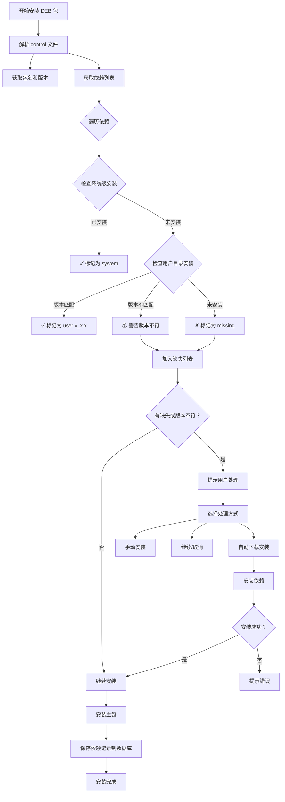

# 用户目录依赖关系管理功能

## 🎯 功能概述

本功能用于记录和管理安装在用户目录（`~/.local`）下的 DEB 包及其依赖关系，支持版本敏感的依赖检测，确保依赖管理的精确性和灵活性。

## ✨ 核心特性

### 1. **依赖关系记录**
- ✅ 自动记录每个安装到用户目录的 DEB 包的依赖关系
- ✅ 保存包名、版本号以及完整的依赖列表
- ✅ 数据存储在 `~/.local/share/debpkg/user_deps.db`

### 2. **版本敏感的依赖检测**
- ✅ **同版本免下载**：如果用户目录下已存在相同版本的依赖，不重复下载
- ✅ **不同版本触发下载**：如果存在版本不匹配，会提示并下载所需版本
- ✅ **精确版本控制**：支持 `>=`, `<=`, `=` 等版本约束

### 3. **智能依赖状态显示**
- ✅ 系统级依赖：标记为 `(system)`
- ✅ 用户目录依赖（版本匹配）：标记为 `(user, v1.2.3)`
- ✅ 用户目录依赖（版本不匹配）：警告提示 `⚠ (user, v1.0.0 installed, v1.2.3 required)`
- ✅ 缺失依赖：标记为 `(missing)`

## 📁 数据库格式

### 数据库位置
```
~/.local/share/debpkg/user_deps.db
```

### 文件格式
```bash
# User Dependencies Database
# Format: PKG_NAME|PKG_VERSION|DEP_NAME1:DEP_VER1,DEP_NAME2:DEP_VER2
# Created by debpkg

mypackage|1.2.3|libfoo:>=1.0.0,libbar:=2.1.0,libbaz:*
anotherapp|3.0.0|libqux:>=3.0.0
```

### 字段说明
- **PKG_NAME**: 包名称
- **PKG_VERSION**: 包的版本号
- **DEP_NAME**: 依赖包名称
- **DEP_VER**: 依赖版本要求（`*` 表示任意版本）

## 🔧 技术实现

### 新增模块

#### `user_deps.h` / `user_deps.c`
用户依赖管理核心模块，提供以下功能：

**核心函数**:
- `init_user_deps_db()` - 初始化用户依赖数据库
- `save_package_dependencies()` - 保存包的依赖关系
- `check_user_dependency_version()` - 检查特定版本的依赖是否已安装
- `get_installed_dep_version()` - 获取已安装依赖的版本号
- `load_package_dependencies()` - 加载包的依赖记录
- `list_user_installed_packages()` - 列出所有已安装的包
- `remove_package_from_deps_db()` - 从数据库中移除包记录

**数据结构**:
```c
typedef struct {
    char pkg_name[256];      // 包名
    char pkg_version[64];    // 包版本
    Dependency *deps;        // 依赖列表
    int dep_count;           // 依赖数量
} UserPackageRecord;
```

### 修改的模块

#### `depends.h` / `depends.c`
添加版本敏感的依赖检查：
- `check_user_dependency_with_version()` - 带版本检测的依赖检查

#### `extract.h` / `extract.c`
添加包版本解析：
- `parse_package_version()` - 从 control 文件解析包版本

#### `install_user.c`
集成依赖记录和版本检测：
- 解析包的版本号
- 使用版本敏感的依赖检查
- 安装成功后保存依赖关系
- 显示详细的依赖状态（包括版本信息）

## 📊 工作流程

### 安装时的依赖处理流程



### 版本检测逻辑

```c
// 检查依赖是否满足
if (check_system_dependency(dep_name)) {
    // 系统级已安装
    return SATISFIED;
} else if (check_user_dependency_with_version(dep_name, required_version, home_dir)) {
    // 用户目录已安装且版本匹配
    return SATISFIED;
} else if (check_user_dependency(dep_name, home_dir)) {
    // 用户目录已安装但版本不匹配
    return VERSION_MISMATCH;
} else {
    // 未安装
    return MISSING;
}
```

## 🎨 使用示例

### 示例 1: 安装带有依赖的包

```bash
./debpkg -u myapp_1.2.3_amd64.deb
```

**输出示例**:
```
[INFO] Checking dependencies...
[INFO] Found 3 dependencies:
  ✓ libfoo                         (system)
  ✓ libbar                         (user, v2.1.0)
  ⚠ libbaz                         (user, v1.0.0 installed, v1.2.0 required)
  ✗ libqux                         (missing)

[WARNING] 1 version mismatch(es):
  - libbaz>=1.2.0
[WARNING] 1 missing dependencies:
  - libqux>=3.0.0

[INFO] Dependency handling options:
  1. Auto-download and install dependencies (RECOMMENDED)
  2. Install missing dependencies manually
  3. Continue installation anyway
  4. Cancel installation

Enter your choice [1-4]: 
```

### 示例 2: 查看依赖数据库

```bash
cat ~/.local/share/debpkg/user_deps.db
```

**输出示例**:
```
# User Dependencies Database
# Format: PKG_NAME|PKG_VERSION|DEP_NAME1:DEP_VER1,DEP_NAME2:DEP_VER2
# Created by debpkg

myapp|1.2.3|libfoo:*,libbar:>=2.0.0,libbaz:>=1.2.0,libqux:>=3.0.0
```

### 示例 3: 查询已安装包

通过 API 可以查询所有用户目录下安装的包：

```c
char **packages;
int count;
if (list_user_installed_packages(&packages, &count, home_dir) == 0) {
    printf("Installed packages (%d):\n", count);
    for (int i = 0; i < count; i++) {
        printf("  - %s\n", packages[i]);
    }
    // 释放内存...
}
```

## 🔄 依赖版本管理策略

### 1. 严格版本匹配（默认）
当依赖指定了具体版本号时，必须完全匹配：
```
libfoo:=1.2.3  # 必须安装 v1.2.3
```

### 2. 最小版本要求
当依赖指定了最小版本时，安装版本必须大于等于该版本：
```
libbar:>=1.0.0  # v1.0.0 或更高版本
```

### 3. 任意版本
当依赖没有指定版本或使用 `*` 时，任何版本都可以：
```
libbaz:*  # 任意版本
```

## 🛠️ 高级功能

### 加载包的依赖记录

```c
UserPackageRecord record;
if (load_package_dependencies("myapp", &record, home_dir) == 0) {
    printf("Package: %s v%s\n", record.pkg_name, record.pkg_version);
    printf("Dependencies:\n");
    for (int i = 0; i < record.dep_count; i++) {
        printf("  - %s %s\n", record.deps[i].name, record.deps[i].version);
    }
    free_user_package_record(&record);
}
```

### 卸载时清理依赖记录

```c
// 从依赖数据库中移除包记录
remove_package_from_deps_db(pkg_name, home_dir);
```

### 获取已安装依赖的版本

```c
char version[64];
if (get_installed_dep_version("libfoo", version, sizeof(version), home_dir) == 0) {
    printf("libfoo version: %s\n", version);
}
```

## 📋 数据库维护

### 手动编辑数据库

可以直接编辑 `~/.local/share/debpkg/user_deps.db` 文件：

```bash
nano ~/.local/share/debpkg/user_deps.db
```

**注意事项**:
- 保持格式：`PKG_NAME|PKG_VERSION|DEPS`
- 依赖之间用逗号分隔
- 包名和版本用 `:` 分隔
- 以 `#` 开头的行是注释

### 数据库验证

检查数据库格式是否正确：

```bash
# 查看数据库内容
cat ~/.local/share/debpkg/user_deps.db

# 统计已安装包数量
grep -v "^#" ~/.local/share/debpkg/user_deps.db | grep -v "^$" | wc -l
```

## 🎯 优势分析

### 1. **避免重复下载**
- 同版本依赖不重复下载，节省带宽和存储空间

### 2. **版本精确控制**
- 支持复杂的版本约束
- 自动检测版本冲突

### 3. **依赖可视化**
- 清晰的依赖状态显示
- 版本信息一目了然

### 4. **离线安装支持**
- 记录已安装的依赖
- 便于离线环境下的依赖管理

### 5. **多包共享依赖**
- 多个包可以共享同一依赖
- 减少冗余安装

## ⚠️ 注意事项

### 1. 版本兼容性
- 版本检测基于文件名和元数据
- 不保证二进制兼容性

### 2. 系统依赖优先
- 始终优先使用系统级依赖
- 用户目录依赖作为补充

### 3. 数据库完整性
- 定期备份数据库文件
- 避免手动修改导致格式错误

### 4. 卸载清理
- 当前版本不会自动删除依赖记录
- 需要手动清理或使用未来版本的卸载功能

## 🔮 未来改进

### 短期计划
- [ ] 实现自动卸载时的依赖记录清理
- [ ] 添加依赖冲突检测
- [ ] 支持依赖树显示

### 中期计划
- [ ] 实现依赖版本升级功能
- [ ] 添加依赖回滚机制
- [ ] 支持依赖缓存管理

### 长期愿景
- [ ] 完整的依赖解析引擎
- [ ] 支持依赖版本锁定文件
- [ ] 跨用户共享依赖库

## 📚 相关文档

- [DEPENDENCY_MANAGEMENT.md](DEPENDENCY_MANAGEMENT.md) - 依赖管理总体说明
- [USER_DIRECTORY_INSTALL.md](USER_DIRECTORY_INSTALL.md) - 用户目录安装指南
- [AUTO_DEPENDENCY_INSTALL.md](AUTO_DEPENDENCY_INSTALL.md) - 自动依赖安装功能

## 🎉 总结

用户目录依赖关系管理功能为 debpkg 提供了强大的依赖追踪和版本控制能力：

✅ **智能检测** - 自动识别已安装的依赖及其版本  
✅ **版本敏感** - 精确匹配版本要求，避免兼容性问题  
✅ **避免冗余** - 同版本依赖不重复下载，节省资源  
✅ **清晰展示** - 依赖状态和版本信息一目了然  
✅ **易于扩展** - 模块化设计，便于未来功能增强  

这标志着 debpkg 在依赖管理方面迈出了重要的一步！
